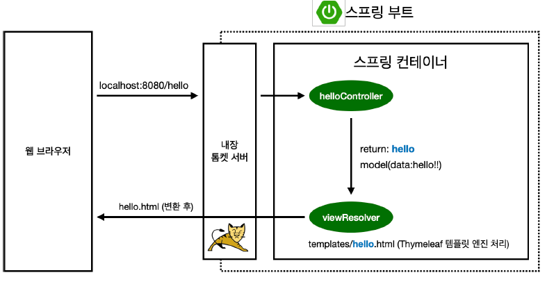

# TIL DAY 01 ( 2024-07-30 )

## dependency
 * Spring Web
    - Spring Boot를 이용하여 웹 프로젝트 개발 시 사용하는 라이브러리
 * Thymeleaf
    - html을 만들어주는 템플릿 엔진

## 로그 관련
현업에서는 System.out.println() 을 사용하지 않고 **로그**를 출력한다. (로깅)<br>
로그를 이용하여 심각한 에러만 따로 보거나, 로그 파일을 관리할 수 있다.<br>
Spring Boot에서는 이를 위해 slf4j를 지원한다.


## Spring Boot & Thymeleaf docs
 * Spring Boot
    - https://docs.spring.io/spring-boot/docs/3.2.x/reference/html/
 * Thymeleaf
    - [Spring 공식 튜토리얼](https://spring.io/guides/gs/serving-web-content)
    - [Spring Boot 매뉴얼](https://docs.spring.io/spring-boot/docs/3.2.x/reference/html/web.html#web.servlet.spring-mvc.template-engines)


## 기본 동작 방식
```java
@Controller
public class HelloController {

	@GetMapping("hello")
	public String hello(Model model) {
		model.addAttribute("data", "spring!!");
		return "hello"; // resources/templates 의 hello.html으로 접근 (Thymeleaf 템플릿 엔진이 처리)
	}
}

```
```html
<!-- resource:templates/hello.html -->
<!DOCTYPE html>
<html xmlns:th="http://www.thymeleaf.org">
<head>
    <meta charset="UTF-8">
    <title>Hello</title>
</head>
<body>
<p th:text="'안녕하세요. ' + ${data}">안녕하세요. 손님</p>
</body>
</html>

```


컨트롤러에서 return 값으로 문자를 반환하면 Spring의 ViewResolver가 화면을 찾아서 처리한다.<br>

